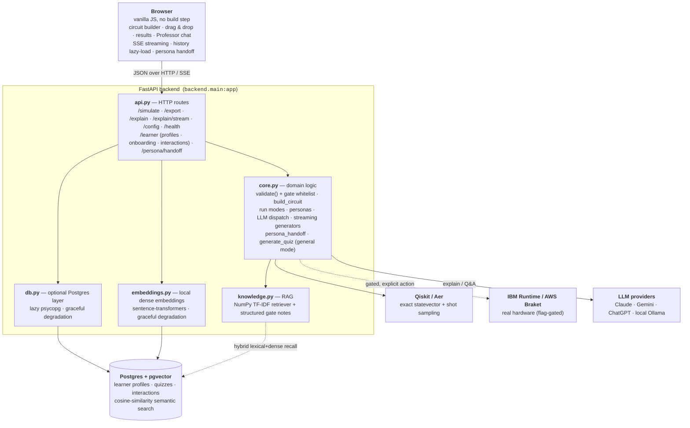

# Quantum Circuit Playground

An interactive, browser-based quantum circuit builder. Drag gates (or whole
algorithms) onto a circuit and watch the measurement histogram, statevector, and
Bloch spheres update live. A FastAPI + [Qiskit](https://www.ibm.com/quantum/qiskit)
backend does the simulation; a dependency-free vanilla-JS frontend handles the UI.


## Features

- **Build controls** — set the number of **Qubits** and measurement **Shots**
  from the toolbar, and watch a live **qubits · depth · gates** readout update as
  you build. **Undo** steps back through your edits and **Clear all** empties the
  canvas. The **Gates**, **Algorithms**, and **Dice** palettes each collapse to
  their label (click the label) so you can reclaim vertical space.
- **Drag-and-drop gates** — single-qubit (H, X, Y, Z, S/Sdg, T/Tdg), rotations
  (RX, RY, RZ with adjustable angle), and multi-qubit gates (CX, CZ, SWAP, CP,
  Toffoli/CCX, Fredkin/CSWAP). Hover a gate (or algorithm/die) in the palette for
  a second to see a tooltip explaining what it is and what it does.
- **Flip the starting state** — click a qubit's `|0⟩` label to start it in `|1⟩`
  instead (equivalent to an X at the front of the wire). The qubit labels and the
  **+ qubit** / **− qubit** buttons stay pinned to the left as the circuit scrolls.
- **Add or remove qubit lines** — the **+ qubit** button adds a wire (up to the
  configured maximum) and **− qubit** drops the last one, along with any gates that
  were sitting on it.
- **Drag-and-drop algorithms** — Bell, GHZ, Grover, Deutsch–Jozsa,
  Bernstein–Vazirani, QFT / inverse QFT, phase estimation, Shor (N=15, a=7),
  teleportation, superdense coding, Simon (s=11), and the swap test. (The
  teleportation and superdense presets use deferred-measurement corrections,
  since the simulator has no mid-circuit measurement.)
- **Quantum D&D dice** — d2 (coin), d4, d6, d8, d10, d12, d20, d100. Each die is
  dual-purpose: **click** it to roll — the die's circuit runs and the result
  flashes large in the centre of the screen — or **drag** it onto the canvas to
  load its exact uniform-superposition prep gates and inspect the full (flat)
  measurement histogram. Use the **Dice** selector to roll several at once (1–10);
  the result modal then shows each die's value prominently plus the **Total**. For
  a single die the modal also shows the **statevector behind the roll** — the
  uniform superposition the die is prepared in. The last five rolls are listed
  inside that modal, newest first. Every face is
  equally likely — and rolling a natural 20 on the d20 sets off a burst of
  fireworks. A roll uses the current **Run on** mode: the classical
  simulator by default, or real quantum hardware when that mode is selected — on
  hardware the result modal spins through random faces until the job returns.
  (Circuits are generated and verified by `backend/gen_dice.py` into
  `frontend/dice.js`.)
- **Move placed gates** — drag a gate already on the circuit to a new column or
  qubit; the rest of the circuit reflows automatically.
- **Live results** — measurement histogram, full statevector table, and a Bloch
  sphere per qubit, recomputed on every edit. The histogram toggles between raw
  **counts** and **probabilities**, sorts in basis order or by value (tallest
  first), and downloads as a **PNG** image or **CSV** of the outcomes. Drag the
  divider between the circuit and the results to retrade vertical space between
  the two panes.
- **Run & queue** — results update automatically as you edit, but pressing
  **Run** also logs a snapshot of the current circuit and its result to the
  **Queue** tab. Each run is a card showing the submitted circuit (click the
  picture to enlarge; it scrolls horizontally when the circuit is wide), a
  timestamp, and the measured histogram. Classical runs are recorded instantly;
  quantum-hardware runs (below) appear as **Pending** first and fill in when the
  device returns. The most-recent finished runs are kept, newest first.
- **Export your circuit** — press **Export** to open a modal with the current
  circuit as runnable **Qiskit** Python and as **OpenQASM 3**, each with a copy
  button. Both forms measure every qubit, so they reproduce the histogram you see
  in the app. The modal also has a **Download PNG** button that saves the circuit
  diagram as an image.
- **Run on real quantum hardware** *(optional)* — set `QCB_ENABLE_QUANTUM_HW=true`
  to reveal a **Run on: Classical simulator / Quantum hardware** toggle. The
  cloud provider is configurable via `QCB_QUANTUM_PROVIDER` — **IBM Quantum**
  (Qiskit Runtime) or **AWS Braket**. In quantum mode you press **Run** to submit
  the circuit to the chosen provider. A hardware run returns measurement counts
  only, so the Statevector and Bloch tabs are filled from a local simulation of
  the same circuit and clearly labeled as simulated (amplitudes and Bloch vectors
  can't be observed on hardware). Because real-device jobs queue for minutes,
  they share the **Queue** tab described above: a hardware run appears as
  **Pending** with a picture of the circuit you submitted, then fills in the
  measured histogram when the device returns. Up to `QCB_QUEUE_MAX` runs
  (default 2) can be in flight at once; while the queue is full the **Run**
  button is disabled with a tooltip explaining why. Each provider has a
  no-credentials local
  simulator default (Aer for IBM, `LocalSimulator` for Braket), so the path works
  out of the box; point it at a real device with the `QCB_IBM_*` / `QCB_BRAKET_*`
  variables below.
- **Ask the Professor** *(optional)* — set `QCB_ENABLE_AI=true` to reveal a
  **Professor** tab: a friendly instructor that explains, in plain language, what
  your circuit does and why it produces its distribution, answers your specific
  questions, and remembers the conversation for follow-ups — each exchange keeps a
  thumbnail of the circuit it was about (click to enlarge) and a timestamp.
  Answers **stream token-by-token** directly into the chat bubble with a blinking
  cursor while the model is generating — no wait, no full page refresh. While
  waiting for a response an **animated typing indicator** (three bouncing dots)
  appears immediately so you always know something is happening.
  Answers render inline **Markdown** emphasis and **LaTeX bra-ket math** (kets,
  fractions, tensor products, roots) with a tiny built-in renderer — no MathJax,
  no extra requests. **Explain this circuit** works even on a blank canvas — the
  circuit thumbnail always shows the qubit wire rails so you can see what was on
  the canvas when you asked. Pick the voice from a
  **Persona** dropdown stocked with 73 characters — each with its own **custom SVG
  avatar** drawn as a recognizable caricature of that person or character, shown
  both on the trigger and in the menu, plus a **hover tooltip** that says who they
  are. The cast spans real scientists (Feynman, Einstein, Marie Curie, Newton,
  Darwin, Bohr, Faraday, Tesla, Ada Lovelace, Carl Sagan, Neil deGrasse Tyson),
  superheroes (Tony Stark, Batman, Captain Marvel), and sci-fi characters from Star
  Trek, Star Wars, Stargate, the Muppets, Firefly, and more (Spock, Data, Yoda,
  Obi-Wan, Darth Vader, Jar Jar, Samantha Carter, Kermit, Beaker, Kaylee, plus a
  certain superposed cat). The Professor is pinned to the top; the rest are listed
  alphabetically. Each persona is just a *voice* — the physics stays correct and
  grounded in your real circuit. **Switching personas mid-conversation** generates
  a short, in-character farewell from the outgoing persona — touching on what you
  covered and sharing a remark about the incoming character — and a greeting from
  the new persona that references the handoff and picks up an interesting thread,
  using your recent conversation as context. An animated typing indicator appears
  while both messages generate. Runs on
  **Claude**, **Gemini**, **ChatGPT** (each needs a key) or a **local Llama** model
  via Ollama (no key) — and if you enable more than one, **Provider** and **Model**
  dropdowns let you switch live.
- **Learner profile** *(optional, requires Postgres)* — the first time you open the
  Professor tab with memory enabled, a short **onboarding modal** asks about your
  background and goals. The LLM extracts a structured profile
  (`level`, `background`, `interests`, `goals`) from your free-text answer and folds
  it into every subsequent prompt so the Professor calibrates its explanations for
  you — a complete beginner gets different intuition-building than someone who already
  knows linear algebra. You can revisit and update the profile any time via the
  **Profile** button. The profile persists across browser sessions via the learner id
  stored in `localStorage`.
- **Conversation history** *(optional, requires Postgres)* — every exchange with the
  Professor is saved so context carries across sessions. When you reopen the app,
  recent history loads automatically; scroll up in the chat to lazy-load older
  exchanges one page at a time without a full page reload. A **"This session"**
  divider separates history from the current live exchange.
- **Retention quizzes** *(optional, requires Postgres + AI)* — after every few
  professor turns the tutor automatically pops a quiz question drawn from what you've
  been discussing. Press **Quiz me** any time to trigger one on demand; if the
  conversation is still empty the quiz picks a general quantum-computing topic instead.
  Type your answer in the text box and press **Submit** — the LLM grades it
  immediately as **correct**, **partial**, or **incorrect** and shows a one-line
  feedback note alongside the reference answer. For multiple-choice questions the
  answer options stay visible read-only after you submit so you can refer back to
  them. Quiz results are stored so the tutor can track what you've covered.
- **Graceful errors** — failures that don't have their own place in the UI (the
  simulator rejecting a circuit, a network call falling over) surface in a clear
  error dialog instead of failing silently, and recoverable problems (a missing
  `/config`, a one-off `/simulate` hiccup) leave the rest of the app working.

## Architecture



**Components**

- **Browser (`frontend/`)** — a dependency-free vanilla-JS UI (no npm, no build
  step). It builds a circuit spec, posts it as JSON, and renders the results and
  the Professor chat. The same `.js` files the browser runs are what the tests load.
- **`backend/api.py`** — the FastAPI app: thin HTTP routes that validate the wire
  format and delegate to `core`. Everything is referenced as `core.<name>` so tests
  can monkeypatch the domain layer.
- **`backend/core.py`** — all domain logic: the **gate whitelist + `validate()`**
  (the security boundary), `build_circuit`, the three run modes (`sim` / `qsim` /
  `quantum`), the persona registry, and the LLM-explainer dispatch.
- **`backend/knowledge.py`** — the explainer's retrieval-augmented grounding: an
  offline **TF-IDF** retriever (pure NumPy) over a hand-authored corpus plus
  structured per-gate notes, merged into the prompt. No LLM, no embeddings.
- **`backend/db.py` + `backend/migrations/`** — the **optional** Postgres layer
  behind the tutor's memory features (profiles, quizzes, interactions, pgvector
  semantic search). It degrades gracefully — the core app never depends on a database.
- **`backend/memory.py`** — a thin repository over the learner, quiz, and interaction
  tables. Covers create/fetch/update profiles; quiz create/grade/list; interaction
  save/recall (recency and pgvector cosine search); and `get_interactions_page` for
  cursor-based paginated history. Sits between the routes and `db.py`; pairs with
  `core.extract_profile` (structured-output LLM call) for onboarding.
- **`backend/embeddings.py`** — a lazy-loaded local encoder wrapper around
  `sentence-transformers` (all-MiniLM-L6-v2, 384 dims). `available()` returns `False`
  gracefully when the package or model is absent; the first call triggers a one-time
  model load (~0.5–2 s on CPU). Embeddings power pgvector cosine-similarity recall in
  hybrid search — recency + semantic, merged and sorted chronologically.
- **External services** — Qiskit/Aer run locally; IBM Runtime / Braket are
  flag-gated and only fire on explicit user action; the LLM providers are pluggable
  (cloud or local Ollama); Postgres runs in Docker (`docker-compose.yml`).

**Key decisions & why**

- **Three-module backend split (`core` / `api` / `main`).** Domain logic is testable
  without HTTP and the routes stay thin; `main` only re-exports `app` so the
  long-standing `backend.main:app` entry point never breaks.
- **Dependency-free frontend.** No build step or framework means anyone can clone
  and run it, and the browser code is unit-tested as-is — a deliberate
  "runs-anywhere" constraint for a portfolio project.
- **The gate whitelist is the security boundary.** `build_circuit` dispatches
  `getattr(qc, name)(*args)`, which is only safe because `validate()` rejects any
  gate not on the allow-list and enforces the `MAX_*` resource bounds.
- **RAG without a vector database first.** Lexical TF-IDF in NumPy is zero-dependency,
  offline, and regression-tested for recall — good grounding on its own. Dense
  embeddings + **pgvector** are added on top to enable *semantic* and *hybrid*
  retrieval (the showcase technique), not as a replacement.
- **Postgres is optional and isolated in `db.py`.** psycopg is imported lazily and
  every failure path (no driver, no URL, server down) degrades to "memory features
  unavailable" — building/simulating/explaining never require a database.
- **pgvector over a separate vector store.** One Postgres instance serves both the
  relational tables and the embedding columns, so there's no second datastore to run.
- **Embeddings via a local library.** Embeddings are produced **in-process by
  `sentence-transformers`** (all-MiniLM-L6-v2) — free, private, offline, and
  reproducible for reviewers, with no API key, no network call, and no separate
  server. The encoder is lazy-loaded and degrades gracefully: interactions are stored
  with NULL embeddings when the library is absent, and semantic recall falls back to
  recency-only. (The *chat* LLM stays cloud-capable since Claude has no embeddings
  endpoint — those are separate concerns.) Generating an embedding needs an encoder
  model — *not* a generative LLM, and *not* Postgres, which only stores and searches
  the vectors.

## Requirements

- Python 3.10+
- `make` (optional but recommended)
- Node 18+ (optional — only to run the frontend test suite; the app itself ships
  no JS toolchain)
- [Docker Desktop](https://www.docker.com/products/docker-desktop/) (optional —
  only for the bundled Postgres behind the tutor's memory features; the core
  playground runs without it). Start Docker Desktop, then `make db-up` to bring
  up the container and `make migrate` to apply the schema. The memory features
  (`/health` → `"healthy": true`) come online automatically once the server
  restarts with a reachable database.

## Getting started

```bash
# 1. clone, then from the project root:
cp .env.sample .env        # optional — defaults work out of the box

# 2. install dependencies into a local virtualenv
make install

# 3. run the app
make run                   # serves http://127.0.0.1:8533
```

Open <http://127.0.0.1:8533> in your browser. Use `make dev` for auto-reload
while editing the backend.

### Without make

```bash
python3 -m venv .venv
.venv/bin/pip install -r requirements.txt
.venv/bin/uvicorn backend.main:app --host 127.0.0.1 --port 8533
```

## Configuration

Copy `.env.sample` to `.env` to override any of these (defaults shown):

| Variable          | Default     | Purpose                                   |
| ----------------- | ----------- | ----------------------------------------- |
| `HOST`            | `127.0.0.1` | Server bind address (Makefile / uvicorn). |
| `PORT`            | `8533`      | Server port.                              |
| `QCB_MAX_QUBITS`  | `16`        | Max qubits (statevector sim is exp. in n).|
| `QCB_MAX_GATES`   | `2000`      | Max gates per circuit.                    |
| `QCB_MAX_SHOTS`   | `100000`    | Max measurement shots.                    |
| `QCB_ENABLE_QUANTUM_HW` | `false` | Show the classical/quantum run toggle. |
| `QCB_QUEUE_MAX`   | `2`         | Max concurrent quantum-hardware runs before Run is disabled. |
| `QCB_QUANTUM_PROVIDER` | `ibm`  | Quantum-run provider: `ibm` or `braket`. |
| `QCB_IBM_BACKEND` | `aer`       | (ibm) `aer` (local), `least_busy`, or a device name. |
| `QCB_IBM_CHANNEL` | `ibm_quantum_platform` | (ibm) Qiskit Runtime channel. |
| `QCB_IBM_TOKEN`   | *(empty)*   | (ibm) IBM Quantum API key (real devices only). |
| `QCB_IBM_INSTANCE`| *(empty)*   | (ibm) IBM Quantum instance/CRN (real devices). |
| `QCB_BRAKET_DEVICE` | `local`   | (braket) `local` simulator, or an AWS device ARN. |
| `QCB_ENABLE_AI`   | `false`     | Show the **Professor** tab.               |
| `QCB_AI_PROVIDER` | `anthropic` | Single-provider mode: `anthropic`, `gemini`, `openai`, or `llama`. |
| `QCB_AI_MODEL`    | `claude-opus-4-7` | Model used for explanations.        |
| `QCB_AI_API_KEY`  | *(empty)*   | API key for the chosen provider (kept out of `/config`). |
| `QCB_PROVIDER_<NAME>` | `false` | Multi-provider mode: toggle `ANTHROPIC`/`GEMINI`/`OPENAI`/`LLAMA` on; each then reads `QCB_<NAME>_API_KEY`/`_MODEL`/`_MODELS`. |
| `QCB_AI_LLAMA_HOST` | `http://localhost:11434` | Ollama server (llama provider). |
| `QCB_DATABASE_URL` | *(empty)*  | Postgres DSN for the optional memory features; unset = run without a DB. |
| `QCB_DB_USER` / `QCB_DB_PASSWORD` / `QCB_DB_NAME` | `qcb` | Credentials for the bundled `docker compose` Postgres. |
| `QCB_DB_PORT`     | `5432`      | Host port for the bundled Postgres (change to avoid clashing). |
| `QCB_DB_CONNECT_TIMEOUT` | `3` | Seconds before a DB connection attempt times out. |
| `QCB_QUIZ_INTERVAL` | `3`      | Professor turns between automatic quiz triggers. Set `0` to disable auto-quiz (manual **Quiz me** still works). |
| `QCB_EMBED_MODEL` | `all-MiniLM-L6-v2` | Sentence-transformers model for local interaction embeddings (semantic recall). |

The `QCB_MAX_*` limits are enforced by the backend to bound resource use —
statevector simulation grows exponentially with the qubit count.

### Running on real quantum hardware

Set `QCB_ENABLE_QUANTUM_HW=true` to reveal the run toggle, then choose a cloud
provider with `QCB_QUANTUM_PROVIDER` — `ibm` (IBM Quantum via Qiskit Runtime) or
`braket` (AWS Braket). Both default to a no-credentials **local simulator**, so
the quantum path works without an account on either; add credentials only to
reach a real device.

**IBM Quantum (`QCB_QUANTUM_PROVIDER=ibm`, the default):**

1. Create a free account at <https://quantum.cloud.ibm.com> and copy your **API
   key** and **instance** (CRN). IBM's free Open Plan includes ~10 minutes of
   QPU time per month.
2. In `.env`, set `QCB_ENABLE_QUANTUM_HW=true`, paste `QCB_IBM_TOKEN` and
   `QCB_IBM_INSTANCE`, and set `QCB_IBM_BACKEND=least_busy` (or a device name).
3. Restart the server, switch the toggle to **Quantum hardware**, and press
   **Run**. Jobs queue, so a run can take a while. Keep `QCB_IBM_BACKEND=aer` to
   exercise the same path locally without spending QPU time.

**AWS Braket (`QCB_QUANTUM_PROVIDER=braket`):**

1. Install the SDK: `pip install amazon-braket-sdk` (or uncomment it in
   `requirements.txt` and re-run `make install`). It's lazily imported, so the
   app runs fine without it until you select the Braket provider.
2. In `.env`, set `QCB_ENABLE_QUANTUM_HW=true` and `QCB_QUANTUM_PROVIDER=braket`.
   Leave `QCB_BRAKET_DEVICE=local` to use the on-machine `LocalSimulator` (no AWS
   account, instant, counts-only) — great for testing the path without spending.
3. For a real device, set `QCB_BRAKET_DEVICE` to an AWS Braket device ARN (an
   on-demand simulator such as
   `arn:aws:braket:::device/quantum-simulator/amazon/sv1`, or a QPU ARN).
   Real devices bill your AWS account and may queue. They authenticate via the
   standard AWS credential chain (`AWS_ACCESS_KEY_ID` / `AWS_SECRET_ACCESS_KEY`
   or a shared profile) and `AWS_REGION` — set those in your shell/AWS config;
   this app never reads or stores AWS secrets.
4. Restart the server, switch the toggle to **Quantum hardware**, and press
   **Run**.

> Note: real hardware (and the local-simulator paths) returns **measurement counts only** —
> amplitudes and Bloch vectors aren't physically measurable. For convenience the
> Statevector and Bloch tabs still populate on a hardware run, but they're
> computed from a **local simulation** of the same circuit and labeled as such.
> Credentials live in `.env`, which is gitignored; never commit them.

### Ask the Professor (AI circuit explainer + Q&A)

Enable a **Professor** tab — a friendly quantum-computing instructor that explains,
in plain language, what the current circuit does and why it produces its
distribution. You can also ask it **anything about quantum computing** — not just
the circuit on the canvas. Ask about the circuit (e.g. "why are only even outcomes
showing up?") and the answer is grounded in your live gate list and outcomes; ask a
broader question (an algorithm, a concept, the hardware) and it answers fully on its
own terms, reaching for your circuit only when it makes a helpful example. When a
question is genuinely ambiguous it asks one short clarifying question first. To keep
answers accurate, a small **curated reference set** is pulled into the prompt: the
gates and foundational concepts implied by your circuit (a direct lookup) plus, for a
free-text question, the most relevant notes on algorithms, concepts, and hardware
found by an **offline TF-IDF retriever** — no embeddings, no extra requests, and it
stays quiet when nothing in the set is relevant. The
**conversation is remembered**, so you can ask follow-ups; press **Clear chat** to
start fresh. Every exchange keeps a **thumbnail of the circuit** it was about
(snapshotted when you asked, so later edits don't change it — click to enlarge)
and a **timestamp**. The thumbnail is always captured, even on a blank canvas
(the qubit wire rails are still visible so you can see the circuit state at the
moment you asked). Answers are formatted on the fly: inline **Markdown**
emphasis and **LaTeX bra-ket math** (kets, fractions, tensor products, square
roots) render via a small hand-written renderer, so the project stays
build-step- and dependency-free. **Explain this circuit** also works on a blank
canvas — it explains the `|0…0⟩` ground state as a starting lesson.

Answers **stream token-by-token** from the server via SSE (`POST /explain/stream`)
and are written directly into the chat bubble as they arrive — a blinking cursor
marks the active stream and disappears when the model finishes. An **animated
typing indicator** (three bouncing dots) appears immediately when you send a
message or trigger a persona switch, so the UI always gives instant feedback
while waiting for the model. All providers support streaming (Anthropic native
streaming, Gemini SSE, OpenAI streaming, Llama NDJSON); a provider with no
streaming handler falls back automatically to a single non-streaming call so all
providers work.

**Switching personas mid-conversation** triggers a handoff: the outgoing persona
delivers a short, in-character farewell that briefly recaps the topics you covered
and shares an in-character remark about the incoming persona, and the new persona
responds with a greeting that references the handoff and picks up an interesting
thread from your conversation. Both messages are live LLM calls
(`POST /persona/handoff`) that receive your recent conversation as context, so a
switch from "The Professor" to "Tony Stark"
feels like a natural handover, not a hard cut. No-op switches (same persona) skip
the LLM calls entirely.

A **Persona** dropdown lets you switch who's explaining. It holds 73 personas,
each with its own **custom SVG avatar** (drawn inline as a recognizable caricature
of that figure — no image files, no extra requests) and a **hover tooltip**
describing who they are: real people get a short factual bio of their scientific
contributions, while fictional characters get an in-universe blurb in their own
voice. The Professor is always first; everyone else is sorted alphabetically. The
roster includes real scientists (Feynman, Einstein, Marie Curie, Newton, Darwin,
Bohr, Faraday, Tesla, Ada Lovelace, Carl Sagan, Neil deGrasse Tyson), pop-science
and superhero figures (Tony Stark, Hank Pym, Dr. Manhattan, Batman, Captain Marvel,
Bob Ross), and a deep sci-fi/pop-culture bench from Star Trek (Spock, Picard,
Data), Star Wars (Yoda, Obi-Wan, Darth Vader, Jar Jar), Stargate (Samantha Carter,
Daniel Jackson, Jack O'Neill), the Muppets (Kermit, Beaker), Firefly (Kaylee), and
even Schrödinger's cat. A couple of personas (Elon Musk, Jar Jar) are deliberately *unreliable* for
comedy and are clearly framed as such, and Beaker — true to form — only ever answers
in a flurry of panicked meeps. Otherwise each persona is just a different *voice*;
the physics stays correct and grounded in your real circuit. (Persona voices and
blurbs live entirely on the server — the browser only sends the chosen key — so
they can't be used to inject prompts.)

You can run the Professor on **Claude**, **Gemini**, or **ChatGPT** (cloud, each
needs a key) or a **local Llama** model via Ollama (no API key, nothing leaves your
machine). Configure one provider the simple way, or enable several and switch
between them — and between their models — using the **Provider** and **Model**
dropdowns in the Professor header. Only providers you've enabled (and that have a
key, where one is needed) ever appear; every key stays server-side.

**Option A — Claude (default):**

1. Get a Claude API key at <https://platform.claude.com> → **API Keys**.
2. In `.env`, set `QCB_ENABLE_AI=true` and paste `QCB_AI_API_KEY` (optionally
   change `QCB_AI_MODEL`). The provider defaults to `anthropic`.
3. Restart the server, open the **Professor** tab, and press **Explain this
   circuit** — or ask a question in the box and press **Ask**.

To run on **Gemini** or **ChatGPT** instead, set `QCB_AI_PROVIDER=gemini` (key from
<https://aistudio.google.com/app/apikey>, e.g. `QCB_AI_MODEL=gemini-2.0-flash`) or
`QCB_AI_PROVIDER=openai` (key from <https://platform.openai.com/api-keys>, e.g.
`QCB_AI_MODEL=gpt-4o`), and put the key in `QCB_AI_API_KEY`.

**Offer several providers at once:** set `QCB_PROVIDER_ANTHROPIC=true`,
`QCB_PROVIDER_GEMINI=true`, `QCB_PROVIDER_OPENAI=true`, and/or
`QCB_PROVIDER_LLAMA=true`, giving each its own `QCB_<NAME>_API_KEY` (and optionally
`QCB_<NAME>_MODEL` / `QCB_<NAME>_MODELS`). The UI then shows a **Provider** picker
and a **Model** picker, and you choose per request.

**Option B — local Llama via Ollama (no key):**

1. Install [Ollama](https://ollama.com) and start it with `ollama serve`.
2. Pull a model, then set `QCB_AI_MODEL` to that exact name. Any chat model
   Ollama can run works — pick one and match the name:
   - `ollama pull llama3.2` → `QCB_AI_MODEL=llama3.2` — **3B, fastest; recommended
     on a CPU-only machine.**
   - `ollama pull llama3` → `QCB_AI_MODEL=llama3` — 8B, noticeably smarter but
     slower (≈2 tokens/sec on a typical laptop CPU, so a full explanation can take
     a couple of minutes).
   - `ollama pull mistral` → `QCB_AI_MODEL=mistral`, etc.
3. In `.env`, set `QCB_ENABLE_AI=true`, `QCB_AI_PROVIDER=llama`, and
   `QCB_AI_MODEL=<the name you pulled>`. No API key is needed. If Ollama runs
   elsewhere, point `QCB_AI_LLAMA_HOST` at it (default `http://localhost:11434`).
4. Restart the server and use the **Professor** tab as above.

> The Professor talks to Ollama with the Python standard library only (no extra
> dependency), and gives a local model up to 5 minutes to reply — the first call
> after `ollama serve` is slowest because the model has to load into memory.
> Bigger models are smarter but slower on a CPU; if explanations time out, switch
> to a smaller model (e.g. `llama3.2`) or run Ollama on a machine with a GPU.

Either way, the backend runs the simulation itself and sends the model the gate
list, the exact circuit as OpenQASM 3, and the real outcome distribution (plus
your question and prior conversation), so the answer stays grounded. Every API key
is read from `.env` only — it is never returned by `/config` or `/explain`.

### Tutor memory (optional Postgres)

The core playground — building, simulating, and explaining circuits — needs no
database. An optional **Postgres** layer backs the tutor's *memory* features:
learner profiles, conversation history, and retention quizzes. Leave
`QCB_DATABASE_URL` unset to run fully in-memory: the memory features then report
themselves unavailable and everything else works.

#### Enabling memory

You need **Docker** (for the bundled Postgres) — or point `QCB_DATABASE_URL` at
any Postgres you already run.

```bash
make db-up        # start Postgres (pgvector image) with the .env credentials
make migrate      # apply the schema (Alembic, plain-SQL migrations)
make run          # the Professor's memory features are now live
```

`GET /health` reports the database status (`driver` installed, `configured`,
`healthy`) — handy for confirming `db-up`/`migrate` worked.

Once the server is running with a healthy database the **Quiz me** and **Profile**
buttons appear in the Professor tab header. If the database is configured but
temporarily unreachable, the buttons are visible but disabled; restart or run
`make db-up` to bring them back.

#### Onboarding

The first time you open the Professor tab with memory enabled, a short modal asks
about your background and what you want to learn. Write a sentence or two — anything
from "I'm a high-school student curious about quantum" to "I know linear algebra but
have never touched Qiskit." The LLM reads your answer and saves a structured profile
(`level`, `background`, `interests`, `goals`). From then on the Professor calibrates
every explanation to you: a beginner gets intuition-building analogies, someone
comfortable with math gets the full formalism.

You can skip onboarding and come back later, or update your profile any time by
clicking the **Profile** button and editing the fields directly.

Your learner id is stored in `localStorage` and sent with every `/explain` and quiz
request, so the tutor knows who you are across browser sessions.

#### Conversation history

Every exchange with the Professor is saved. When you reopen the app your recent
exchanges load automatically; scroll up in the chat to page through older history
one batch at a time. A **"This session"** divider marks where the loaded history
ends and the current conversation begins.

If `sentence-transformers` is installed (`pip install sentence-transformers`, already
in `requirements.txt`), each interaction is also stored with a **dense embedding**
so the tutor can retrieve semantically relevant past exchanges — not just the most
recent ones — when generating quiz questions. When the encoder is absent, semantic
recall silently falls back to recency-only.

#### Quizzes

**Automatic quizzes.** After every N professor turns (default 3, tunable with
`QCB_QUIZ_INTERVAL`) the tutor automatically generates a short quiz question drawn
from what you've been discussing and slides it into the chat.

**Manual quizzes.** Click **Quiz me** any time to trigger one on demand. If the
conversation is still empty (no exchanges yet), the quiz picks a general
quantum-computing topic at random rather than asking about nothing.

**Answering.** Type your answer in the text area that appears below the question and
press **Submit answer**. The LLM grades your response as **correct**, **partial**, or
**incorrect** and shows a brief feedback note and the reference answer inline. There
is no time limit; take as long as you need. For multiple-choice questions the answer
options remain visible read-only after you submit, so you can refer back to the
choices while reading the feedback.

**Clearing a quiz.** Press **Dismiss** to skip a question — for example if it covers
something you haven't studied yet. The Quiz me button becomes available again
immediately.

Quiz results are stored so the tutor has a record of what you've covered. You can
retrieve a learner's quiz history via `GET /learner/{id}/quizzes`.

#### API reference

<details>
<summary>Learner profile routes</summary>

| Route | Purpose |
| --- | --- |
| `POST /learner` | Mint a fresh learner; the client stores the returned `id` in `localStorage`. |
| `GET /learner/{id}` | Fetch a stored profile (404 if unknown). |
| `POST /learner/{id}/onboarding` | Send the student's free-text intake answer; the LLM extracts a structured `{level, background, interests, goals}` profile (a *structured-output* call), saved and stamped `onboarded_at`. |
| `PUT /learner/{id}/profile` | Directly edit profile fields (the profile panel). |

</details>

<details>
<summary>Interaction history routes</summary>

| Route | Purpose |
| --- | --- |
| `GET /learner/{id}/interactions` | Paginate interaction history (cursor-based via `before_id`; default 20, cap 50, oldest-first). |

</details>

<details>
<summary>Quiz routes</summary>

| Route | Purpose |
| --- | --- |
| `POST /learner/{id}/quiz` | Generate a quiz question from `context` (recent turns) or, when context is empty, a general quantum quiz; returns `{quiz_id, question, topic}` without revealing the reference answer. |
| `POST /learner/{id}/quiz/{qid}/answer` | Submit + LLM-grade the student's answer; returns grade, score, feedback, and the reference answer. Returns **409** if already answered. |
| `GET /learner/{id}/quizzes` | List a learner's quiz history (newest first, cap 50). |

`/config` exposes `memory_enabled` (driver + URL configured) and `quiz_interval`.
Quiz generation lives in `core.generate_quiz`; grading in `core.grade_quiz`.

</details>

## Make targets

| Target         | Description                                  |
| -------------- | -------------------------------------------- |
| `make bootstrap` | Install system dependencies (Docker, Python, Node) via Homebrew. Run once on a fresh macOS machine before anything else. |
| `make install` | Create `.venv` and install Python dependencies. |
| `make run`     | Start the server.                            |
| `make dev`     | Start with auto-reload.                      |
| `make db-up`   | Start the optional Postgres container.       |
| `make db-down` | Stop it (the data volume is kept).           |
| `make db-logs` | Tail the Postgres container logs.            |
| `make migrate` | Apply database migrations (Alembic).         |
| `make test`    | Run **all** tests (backend + frontend).      |
| `make test-backend`  | Run only the backend (pytest) tests.   |
| `make test-frontend` | Run only the frontend (`node --test`) tests. |
| `make clean`   | Remove `.venv` and Python caches.            |

## Tests

There are two suites — `make test` runs both, or run one with `make test-backend`
/ `make test-frontend`.

**Backend** — a [pytest](https://docs.pytest.org) suite under `backend/tests/` covers the
security boundary (gate whitelist + resource bounds in `validate`), circuit
correctness — including Qiskit's little-endian convention — the AI provider and
persona registries, the export/codegen helpers (Qiskit + OpenQASM 3, angle
formatting, the grounded explainer prompt), the curated reference set behind the
explainer (every whitelisted gate has a note; retrieval pulls the right notes,
always includes the foundational concepts, dedupes, and stays within its size
bounds), and the HTTP endpoints (`/config`, `/simulate`, `/export`, `/explain`). It
is split by concern: `test_core.py` and `test_export.py` exercise the domain logic
in `backend/core.py` directly, `test_knowledge.py` covers the reference set and
retrieval in `backend/knowledge.py`, `test_api.py` drives the FastAPI routes
through a `TestClient` (shared fixtures live in `conftest.py`), and `test_db.py` +
`test_memory.py` cover the optional Postgres layer and learner profiles — the
graceful-degradation contract (no driver or no `QCB_DATABASE_URL` → memory features
simply report unavailable with a 503, never crash) and the structured-output
profile extraction (through a fake handler) run everywhere, while the live
round-trip tests skip unless a migrated database is reachable. Additional suites
cover the newer features: `test_quiz.py` for retention quizzes and grading,
`test_embeddings.py` for local encoder graceful degradation, `test_handoff.py` for
persona handoff (both the `core.persona_handoff` domain function and the
`POST /persona/handoff` route), `test_stream.py` for the SSE streaming endpoint and
the per-provider streaming generators (Anthropic, Gemini, OpenAI, Llama — each
exercised with a fake HTTP layer so no real network calls are made), and
`test_interactions_history.py` for the `GET /learner/{id}/interactions` endpoint,
the `memory.get_interactions_page` pagination function, and `core.generate_quiz`
with the general-quiz flag. The tests never make a real network, LLM, or quantum
call: every provider is monkeypatched, and a key check asserts no API key ever
appears in `/config`.

**Frontend** — a suite under `frontend/tests/` exercises the pure UI logic (the gate
catalog and algorithm presets, the bra-ket LaTeX + Markdown renderer, the circuit
state mutations, and the run-queue bookkeeping), with happy- and sad-path cases for
each. To honor the project's no-build-step / no-npm rule, it uses **Node's built-in
test runner** (`node --test`, no dependencies): a small harness in
`frontend/tests/harness.mjs` loads the real `frontend/*.js` source files into a
sandboxed `vm` context with a stub DOM, so the same code the browser runs is tested
directly. Requires Node 18+ (only for the tests — the app itself ships no JS
toolchain).

```bash
make test            # both suites
make test-backend    # or: .venv/bin/python -m pytest backend
make test-frontend   # or: node --test frontend/tests/*.test.mjs
```
